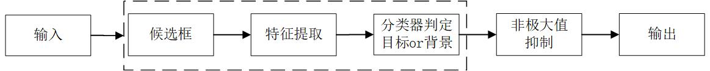

# 摘要

&nbsp;&nbsp;&nbsp;&nbsp;随着计算机的运算速度的大幅度提升和计算总体资源的不断增加，卷积神经网络在目标检测上的运用越来越广泛。本文通过阅读大量文献，总结了基于深度学习的二阶段和一阶段神经网络的目标检测算法的基本发展历程，并对其优劣进行了一定的讨论。本文复现了经典的一阶段目标检测网络YOLOv5(YOLO: You Only Look Once)算法。在复现过程中，针对Mosaic数据增强、自适应锚框计算、自适应图片缩放等部分进行了详细介绍。使用VOC2007和VOC2012数据集的训练集和验证集共同作为YOLOv5网络模型进行有监督训练的情况下，在VOC2007测试集上的平均精度可以达到78.2%。高于原文所提到的74.3%，证明了网络复现的有效性。此外，模仿人类视觉感受野，在YOLOv5网络中引入FPN+PAN(FPN: Feature Pyramid Networks；PAN: Pyramid Attention Network)结构后，可以增强卷积神经网络的特征提取能力。实验结果表明，在相同条件下，引入FPN+PAN结构的却可以使YOLOv5网络模型的性能提升。 &nbsp;&nbsp;&nbsp;&nbsp; **关键词：** 目标检测；卷积神经网络；YOLOv5；Pytorch

# Abstract

&nbsp;&nbsp;&nbsp;&nbsp;With the great increase in computer speed and the continuous increase of computing resources, convolutional neural networks are more and more widely used in object detection. Through the investigation of a large number of literature, this paper summarizes the basic development process of two-stage and first-stage neural networks based on deep learning, and compares their advantages and disadvantages to a certain extent. This article reproduces the classic one-stage object detection network YOLOv5 (YOLO: You Only Look Once) algorithm. In the process of reproduction, detailed designs are made for data storage, data enhancement, main network selection, feature mapping layer selection, default boundary design, and difficult case mining. With supervised training using the training set and validation set of the VOC2007 and VOC2012 datasets together as a YOLOv5 network model, the average accuracy on the VOC2007 test set can reach 78.2%. Higher than the 74.3% mentioned in the original text, it proves the effectiveness of network reproduction and further improvement. In addition, by mimicking human visual perception fields, the feature extraction capabilities of convolutional neural networks can be enhanced by introducing FPN+PAN (FPN: Feature Pyramid Networks; PAN: Pyramid Attention Network) structures in yolOv5 networks. Experimental results show that under the same conditions, the introduction of FPN+PAN structure can improve the accuracy of the YOLOv5 network model by more than 2%. &nbsp;&nbsp;&nbsp;&nbsp;&nbsp;&nbsp;&nbsp;&nbsp;**Keywords：** Object Detection；Convolutional Neural Networks；YOLOv5；Pytorch

# 第一章 绪论

## 1.1 研究背景及意义

&nbsp;&nbsp;&nbsp;&nbsp;随着计算资源的丰富，人们渐渐地不满足于仅仅使用计算机作为普通的运算工具，逐渐将目光投向智能机器，期望其可以像人类一样识别物体，语音，理解文本，甚至能够思考。根据实验心理学家赤瑞特拉（Treicher）做过的心理实验，对于人而言，有83%的信息来自视觉；因此，对于机器智能而言，机器视觉自然也成为了经久不衰的研究方向。目前，机器视觉领域主要研究基本可划分为四类问题：目标分类，解决分析目标 “是什么“ 的问题，给定的图片中一般仅包含一类物体；目标检测，解决物体 “在哪里，是什么” 的问题，图片里可能包含一个或者多个物体，在对物体进行分类的时，同时输出物体在图片里的位置；语义分割，通过查找属于图片的所有像素点，识别图像中存在的内容以及位置；实例分割，在语义分割基础上，进一步将每类的像素点分类到每类的每个实体上，实例分割可以定义为同时解决目标检测问题和语义分割问题的技术。 &nbsp;&nbsp;&nbsp;&nbsp;传统机器视觉技术使用图片的数学统计特征来进行分析，由于待测目标成像时存在多样性变化和干扰，手动选择特征没有较好的鲁棒性，这使得传统检测技术的准确性和实时性存在着许多挑战。直到2012年，Hinton等在目标检测数据集 Image Net 大规模视觉识别挑战的分类任务中首次将深层卷积神经网络 Alex Net 应用于大规模图像分类中以获得冠军，再一次为机器视觉领域的研究注入了新活力。目前，已有许多高校、研究院和公司投入大量人力、物力到该领域，期盼能利用机器学习方法在机器视觉领域取得更大突破。如百度、华为等公司已出现自动驾驶相关技术的应用实例。而作为人脸识别、自动驾驶等技术的基础，目标检测领域愈发颇受关注。 &nbsp;&nbsp;&nbsp;&nbsp;目标检测领域，提高准确性与实时性一直以来是人们致力于研究的两大方向。然而，在大多数的情况下，准确性与实时性的提升是一对难以调和的矛盾，如何获取它们之间的平衡点是一个十分重要的问题，基于深度学习的目标检测技术的发展也丝毫不例外。 &nbsp;&nbsp;&nbsp;&nbsp;多阶段目标检测技术包含区域建议、提取特征、特征分类、边界框回归等多个步骤，技术的发展也主要围绕着对这几个步骤进行改进而发展。例如：区域建议算法从传统的选择搜索算法(SS: selective search)，一直演绎到如今的RPN(RPN: region proposal network)算法；特征提取的主网络也从VGG16，演化到ResNet101等；此外，为了提升目标检测网络的实时性，降低其训练的负载，也演化出许多一阶段目标检测网络，例如YOLO(YOLO: you only look once) ，SSD(SSD：single shot object detector)等，可以同时对图片里所含的物体进行定位和分类。虽然一阶段目标检测网络在实时性上有较大幅度提升，但是其准确率相对于多阶段网络而言，有一定的损失。如何在不损失一阶段目标检测检测速度的前提下，尽可能地提高其准确性，已然成为一个新的研究热点。 &nbsp;&nbsp;&nbsp;&nbsp;本文研究基于深度学习的目标检测算法，但鉴于目标检测网络的快速发展，本文将重点研究基于深度学习的一阶段目标检测算法。通过将区域建议、目标分类以及定位合成在一个网络中，大幅度降低了其网络模型的训练时间，同时也加快了其检测速度。针对一阶段目标检测网络，除去了复杂度高的区域建议阶段，在网络的一层或者多层上设计了不同宽高比和不同大小的默认边界，并且针对每一个默认边界进行目标分类和位置回归，最后通过非极大值抑制算法得出目标检测结果。网络模型简洁，训练负载小，检测速度快。 &nbsp;&nbsp;&nbsp;&nbsp;本文主要任务是复现目前比较新的YOLO系列算法中的YOLOv5算法。

## 1.2 国内外研究现状分析

&nbsp;&nbsp;&nbsp;&nbsp;基于深度学习的目标检测算法，根据其是否包含单独的候选框提出阶段，可以分为多阶段目标检测算法和一阶段目标检测算法。多阶段目标检测算法包含独立的候选框提出阶段，其将目标检测分为候选框提出、背景及前景筛选、对前景区域进行分类与位置回归等多个串联步骤。其中的典型代表为R-CNN(R-CNN：Region with CNN features)系列算法。 &nbsp;&nbsp;&nbsp;&nbsp;R-CNN算法，首先使用选择搜索提出候选区域，并从中选择约2000个存在物体可能性较大的建议区域，然后对建议区域进行预处理，采用填充、剪切、缩放等方法使之具备相同大小，再使用一个CNN网络对这些建议区域提取一定长度的特征；最后训练一个支持向量机(SVM，support vector machine)将提取后的特征向量分为若干个物体类，并为每一类物体训练一个位置回归器，生成预测窗口坐标。在此模型训练时，针对训练数据不足的问题，算法主要采用先在大型辅助数据集上进行训练，然后针对训练目标对网络参数进行微调的方法；除此之外，提出提取图片特征所用的卷积神经网络会对检测结果产生较大的影响。由于R-CNN网络的训练和测试阶段均包含多个步骤，包括使用传统的选择性搜索算法进行区域建议，对用于特征提取的网络模型在预训练的基础上进行参数微调，对用于分类的支持向量机的训练和用于对每一类物体进行定位的多个位置回归器的训练等，步骤较为繁琐，训练和测试所需时间均较长，远远不能达到对图片进行实时处理的要求；而且由于包含多个全连接层，训练时大量网络参数存储在内存中，5000张左右的图片就会产生多达几百G的数据文件，造成了计算资源的极大浪费；同时，它的平均精度仅有53.3%，准确率有待提高。 &nbsp;&nbsp;&nbsp;&nbsp;Fast R-CNN算法在R-CNN算法的基础上，将物体分类和定位统一成一个网络。首先，同文献[1]一样，使用SS算法提出建议区域，并使用卷积神经网络提取特征；不同点在于在设计损失函数时，Fast R-CNN网络模型使用多任务损失函数作为损失函数，同时对物体分类和位置回归进行训练。其中检测分类概率使用交叉熵损失函数；物体位置回归针对边界中心点坐标和宽、高使用均方差损失函数。此网络摒弃了R-CNN网络前端的全连接层，仅在网络末端使用全连接层进行物体分类，其余部分完全使用卷积神经网络，然后在进入最终的分类全连接层之前通过最大池化层进行池化。因此可使不同大小的建议区域，生成相同长度的特征映射，这也使其具备了处理不同大小的输入图像的能力。Fast R-CNN网络使用一个卷积神经网络同时对图片中所包含的物体进行分类和位置回归，在训练和测试时所耗时间均比R-CNN更短。在以VGG16作为特征提取的主体网络时，以相同大小的图片作为输入时，Fast R-CNN的训练所耗时间仅为R-CNN的1/9，测试所耗时间更是缩减到了将近1/200。此外，由于减少了全连接层的数量，其训练参数的数量大幅减少，降低了模型训练时对系统的负载，节省了大量计算资源。该网络模型在检测准确率上也有所上升，以VOC07作为训练集和测试集时，平均精度达到了66.9%。尽管其训练和检测速度有所提升，在不考虑区域建议所耗时间的基础上，勉强达到了实时检测的目的；然而其使用的传统区域建议算法SS，耗时几乎和主网络相同，成为了该算法在速度提升上的瓶颈。  &nbsp;&nbsp;&nbsp;&nbsp;为了进一步提升算法速度，Faster R-CNN算法，首次提出使用卷积神经网络进行区域建议，突破了传统区域建议算法在运算速度上的瓶颈。该算法在最后一个卷积层后，对网络结构进行改进，将其分为两个部分：一部分替代原先的SS区域建议方法，对输入图片进行区域建议，另一部分负责对建议区域进行物体分类和位置回归。在训练时，Faster R-CNN网络模型首先针对区域建议和目标分类进行单独训练；然后使两个功能共用的部分网络参数保持不变，对后续网络分别进行微调，并将此过程反复迭代多次。该方法共享区域建议和目标检测部分的卷积神经网络，一方面减小了区域建议的数量，将其从原有的2000多个减少为300个，而且其质量也有了很大提高；另一方面，其与目标分类共享网络，区域建议几乎与目标分类任务同步进行，不需耗费额外的时间，大幅度提高了目标检测的速度。此网络可以达到处理一张图片耗时仅2ms，且平均精度达到69.9%。 &nbsp;&nbsp;&nbsp;&nbsp;在多阶段目标检测算法不断进步的同时，部分研究者另辟蹊径，进一步提出了一阶段目标检测算法，包括YOLO，SSD等。 &nbsp;&nbsp;&nbsp;&nbsp;YOLO算法，通过一个单独的卷积神经网络同时对输入图片所包含的物体进行分类和定位。所有图片在输入前均缩放为448×448，然后在卷积神经网络的最后一个特征映射层上设计多个不同尺度不同大小的默认边界，并使用多任务损失函数，同时得出检测的物体类别和边界位置。使用单独的网络进行目标检测大大提升了目标检测的速度，使之可以达到45帧每秒，同时达到63.4%的平均精度；使用更少卷积层和更小滤波器的Fast YOLO更是可以达到惊人的155帧每秒。以VGG16作为主网络的Faster R-CNN比YOLO在平均精度上高出了10%左右，但是其速度只有YOLO的1/6；以ZFnet作为主网络的Faster R-CNN仅比YOLO慢了2.5倍，但它的精度比YOLO更低。YOLO使用较深的特征映射层，对小物体的检测效果较差，且容易出现严重的定位错误；对于与训练集所包含物体不同的宽高比的物体，其定位误差更大。 &nbsp;&nbsp;&nbsp;&nbsp;SSD目标检测算法在多个特征映射层上设计不同宽高比和大小的默认边界，并将不同特征映射层所得到的预测边界结合起来，经过非极大值抑制方法来去除针对同一个物体的重叠边界，生成最终的边界。SSD网络充分利用了一张图片不同尺度的特征，大大提高了检测的准确度。在VOC2007测试集上，SSD300的平均精度可以达到74.3%，检测速度可以达到59帧每秒，是第一个可以实现平均精度高于70%的实时检测方法。 &nbsp;&nbsp;&nbsp;&nbsp;综上所述，一阶段目标检测算法YOLO具有实现实时检测的潜能，因此重现YOLO算法，并基于此进行一定程度的改进，具有较大的研究意义。

## 1.3 本文的主要工作及篇章结构

&nbsp;&nbsp;&nbsp;&nbsp;本文的主要工作为基于python编程语言的Pytorch架构，对经典的基于卷积神经网络的一阶段目标检测网络YOLOv5进行设计与复现。首先，概述了常见的基于深度学习的几种目标检测算法及其演进关系。其次，总结了部分传统目标检测算法及其可以迁移运用的几个思想。随后概述了卷积神经网络的基本架构及常用数据集和评测指标。在对一阶段目标检测算法YOLOv5的设计方案进行详细分析的基础上，针对损失函数和网络架构，分别引入了Focal Loss和RFB网络结构，并针对其对YOLOv5网络性能的影响进行了实验验证和分析。 &nbsp;&nbsp;&nbsp;&nbsp;第一章从本文的研究背景和实际意义出发，总结了基于神经网络的二阶段和一阶段目标检测算法，并分析了算法性能与其相互之间的演进关系及优劣比较。 &nbsp;&nbsp;&nbsp;&nbsp;第二章概述了常见的目标检测算法，包括传统目标检测算法，如基于Haar纹理特征、用于人脸识别的V-J算法、基于方向梯度直方图特征的算法等；此外，还有基于深度学习的目标检测算法的主要架构，训练方法，常用数据集及主要衡量指标。 &nbsp;&nbsp;&nbsp;&nbsp;第三章详细介绍了基于卷积神经网络的一阶段目标检测算法YOLOv5的复现过程，包括网络的总体架构、数据存储、数据增强、主网络选取、特征映射层选取及默认边界设计、损失函数设计与训练流程等。 &nbsp;&nbsp;&nbsp;&nbsp;第四章主要展示了模型的训练结果和针对损失函数和网络架构的改进方案的效果，分析了其对YOLOv5架构的影响及原因。 &nbsp;&nbsp;&nbsp;&nbsp;第五章对本文的研究成果进行总结，指出了本文在网络复现及改进过程中的几个创新点，并提出了未来可能的几个研究方向。 

# 第二章 目标检测算法概述

## 2.1 传统目标检测算法

&nbsp;&nbsp;&nbsp;&nbsp;在卷积神经网络被广泛应用于目标检测之前，由于缺乏足够的手段来提取特征，早期的目标检测算法多是基于各种统计特征所构建的，如Haar特征，HOG特征等。同时，由于计算资源的匮乏，人们不得不同时寻找更加精巧的计算方法来加速目标检测模型。图2.1展示了传统的目标检测算法流程。 

图2.1 传统目标检测算法流程

&nbsp;&nbsp;&nbsp;&nbsp;虚线框所包含部分为传统目标检测算法与基于深度学习的多阶段目标检测算法在流程上相似，但处理方法有异的地方。传统目标检测算法多采用保守的候选框提出方法，如滑动窗口结合图片特征金字塔的方法；此外，其提取的特征主要包括图片的统计特征，底层特征和中层次特征，如颜色，纹理等；多采用支持向量机算法，Adaboost算法等将所提取的图片特征分至若干物体类。使用选择性搜索算法，或是神经网络提出候选框，是基于深度学习的多阶段目标检测算法中更为常用的区域建议方案；而一阶段目标检测算法直接设计一系列默认边界，同时完成物体识别和位置回归两个任务，无需使用单独步骤提取候选框；其次，其主要使用卷积神经网络和全连接层进行特征提取及分类和定位。 &nbsp;&nbsp;&nbsp;&nbsp;2001年提出的V-J目标检测算法，第一次基本实现了人脸的实时检测。其采用最基础的滑动窗口方式提出候选框，即在图像的每一个像素点对每一种可能的尺度进行遍历，逐一判断其是否为人脸目标。其提取多尺度Haar特征，即白色像素点与黑色像素点的差分，来表现图片的各种纹理特征。设计了过完备的随机Haar特征，并使用Adaboost算法从该过完备集中选取那些对人脸检测最为有用的几种特征，由此减小不必要的计算开销。其流程如表2.1所示：

表2.1  V-J算法主要流程

| 表2.1  V-J算法主要流程 |
|:-:|
|1.	初始化样本权重w，使权重之和为1；|
|2.	训练弱分类器Adaboost。其每一步迭代仅使用了18万特征中的一个，因此称之为弱分类器；|
|3.	更新样本权重；|
|4.	重复步骤2，直到达到最大步骤数；|
|5.	结合多个弱分类器的结果进行投票。|

&nbsp;&nbsp;&nbsp;&nbsp;传统目标检测算法中常用的另一种统计特征是方向梯度直方图特征(HOG：Histogram of Oriented Gradient)。其使用图片中若干个连通区域的像素点梯度直方图作为特征描述符。提取HOG特征的目标检测算法，多采用窗口大小固定的检测器，使图像依次缩放后构建多尺度图像金字塔的方法来提出候选框。为了兼顾检测速度和识别精度，HOG检测通常采用线性分类器或级联决策分类器。但HOG特征很难处理遮挡问题，图片中所包含的人体姿势动作幅度过大或物体方向改变也不易被检测。 &nbsp;&nbsp;&nbsp;&nbsp;可变部件模型算法(DPM：Deformable Part based Model)算法是一种基于物体部件的目标检测算法，对物体可能发生的姿势改变、角度改变等可能发生的形变具有很强的鲁棒性。其提取改进后的HOG特征，即将当前细胞单元与其相邻四个单元统一进行归一化以提取特征。在模型结构上，其由一系列滤波器构成，以分解一个物体不同的部件。如：针对行人，可以分解为头部，躯干，四肢等部分；针对汽车，可分解为车身、轮胎等部分。在模型训练时，使用弱监督学习策略，不需要图片标注一个物体的全部结构，仅有部分结构进行标注也可以进行学习。 &nbsp;&nbsp;&nbsp;&nbsp;2012年以来，神经网络技术为目标检测领域注入了新的活力。尽管基于神经网络技术的相关算法在很多机器视觉任务上的表现优于传统算法，如图片分类，目标检测等。但是以目标检测算法为例，我们可以发现运用在传统目标检测算法中的很多思想对当今的目标检测算法仍有着不可忽视的影响。例如，基于深度学习的二阶段目标检测算法在算法流程上基本继承了传统目标检测算法的思路。DPM等算法中使用的难样本挖掘技术，针对默认边界进行位置回归，上下文信息的利用等，即使在一阶段目标检测算法的网络设计中也体现了相关思想，如SSD算法严格控制正负样本比例约为1:3以进行难例挖掘；引入扩张卷积层以更好的利用图片的上下文信息。 

## 2.2 基于深度学习的目标检测算法

