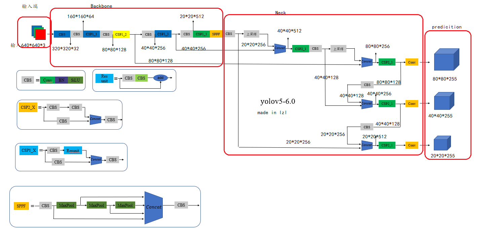
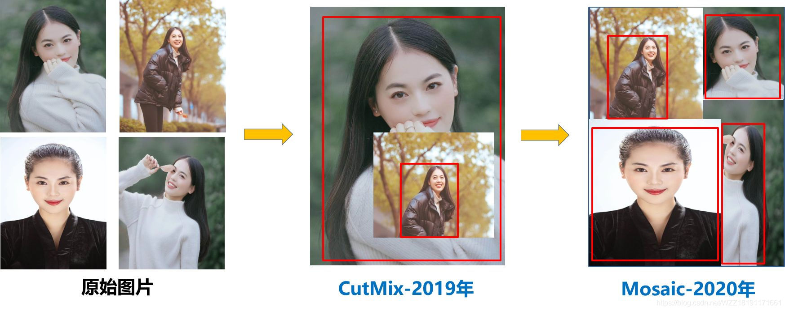

# 摘要

&nbsp;&nbsp;&nbsp;&nbsp;随着计算机的运算速度的大幅度提升和计算总体资源的不断增加，卷积神经网络在目标检测上的运用越来越广泛。本文通过阅读大量文献，总结了基于深度学习的二阶段和一阶段神经网络的目标检测算法的基本发展历程，并对其优劣进行了一定的讨论。本文复现了经典的一阶段目标检测网络YOLOv5(YOLO: You Only Look Once)算法。在复现过程中，针对Mosaic数据增强、自适应锚框计算与自适应图片缩放等部分进行了详细介绍。使用VOC2007和VOC2012数据集的训练集和验证集共同作为YOLOv5网络模型进行有监督训练的情况下，在VOC2007测试集上的平均精度可以达到78.2%。高于原文所提到的74.3%，证明了网络复现的有效性。此外，模仿人类视觉感受野，在YOLOv5网络中引入FPN+PAN(FPN: Feature Pyramid Networks；PAN: Pyramid Attention Network)结构后，可以增强卷积神经网络的特征提取能力。实验结果表明，在相同条件下，引入FPN+PAN结构的却可以使YOLOv5网络模型的性能提升。 &nbsp;&nbsp;&nbsp;&nbsp; **关键词：** 目标检测；卷积神经网络；YOLOv5；Pytorch

# Abstract

&nbsp;&nbsp;&nbsp;&nbsp;With the great increase in computer speed and the continuous increase of computing resources, convolutional neural networks are more and more widely used in object detection. Through the investigation of a large number of literature, this paper summarizes the basic development process of two-stage and first-stage neural networks based on deep learning, and compares their advantages and disadvantages to a certain extent. This article reproduces the classic one-stage object detection network YOLOv5 (YOLO: You Only Look Once) algorithm. In the process of reproduction, detailed designs are made for data storage, data enhancement, main network selection, feature mapping layer selection, default boundary design, and difficult case mining. With supervised training using the training set and validation set of the VOC2007 and VOC2012 datasets together as a YOLOv5 network model, the average accuracy on the VOC2007 test set can reach 78.2%. Higher than the 74.3% mentioned in the original text, it proves the effectiveness of network reproduction and further improvement. In addition, by mimicking human visual perception fields, the feature extraction capabilities of convolutional neural networks can be enhanced by introducing FPN+PAN (FPN: Feature Pyramid Networks; PAN: Pyramid Attention Network) structures in yolOv5 networks. Experimental results show that under the same conditions, the introduction of FPN+PAN structure can improve the accuracy of the YOLOv5 network model by more than 2%. &nbsp;&nbsp;&nbsp;&nbsp;&nbsp;&nbsp;&nbsp;&nbsp;**Keywords：** Object Detection；Convolutional Neural Networks；YOLOv5；Pytorch

# 第一章 绪论

## 1.1 研究背景及意义

&nbsp;&nbsp;&nbsp;&nbsp;随着计算资源的丰富，人们渐渐地不满足于仅仅使用计算机作为普通的运算工具，逐渐将目光投向智能机器，期望其可以像人类一样识别物体，语音，理解文本，甚至能够思考。根据实验心理学家赤瑞特拉(Treicher)曾做过的心理实验,对于人来说,有83%的信息是来自视觉；因此，对于机器智能而言，机器视觉自然也成为了经久不衰的研究方向。目前，机器视觉领域主要研究基本可划分为四类问题：目标分类，解决分析目标 “是什么“ 的问题，给定的图片中一般仅包含一类物体；目标检测，解决物体 “在哪里，是什么” 的问题，图片里可能包含一个或者多个物体，在对物体进行分类的时，同时输出物体在图片里的位置；语义分割，通过查找属于图片的所有像素点，识别图像信息中实际存在的图像内容信息及其存储位置；实例分割,在语义分割的基础上，进一步将每类的像素点分类到每类的每个实体上，实例分割可以定义为同时解决目标检测问题和语义分割问题的技术。 &nbsp;&nbsp;&nbsp;&nbsp;传统机器视觉技术使用图片的数学统计特征来进行分析，由于待测目标图像时存在多样变异和影响，自动选择特性没有较好的鲁棒性，这使得传统测量信息技术的准确度和即时性存在着许多问题与挑战。直到2012年，Hinton等在目标检测数据集 Image Net 大规模视觉识别挑战的分类任务中第一次将深度卷积神经网络Alex Net应用于大型图形分类方法中以获得冠军，再一次为机器视觉领域的研究注入了新活力。目前，已有许多高校、研究院和公司投入大量人力、物力到该领域，期盼能利用机器学习方法在机器视觉领域取得更大突破。如百度、华为等公司已出现自动驾驶相关技术的应用实例。而作为人脸识别、自动驾驶等技术的基础，目标检测领域愈发颇受关注。 &nbsp;&nbsp;&nbsp;&nbsp;目标检测领域，提高准确性与实时性一直以来是人们致力于研究的两大方向。然而，在大多数的情况下，准确性与实时性的提升是一对难以调和的矛盾，如何获取它们之间的平衡点是一个十分重要的问题，基于深度学习的目标检测技术的发展也丝毫不例外。 &nbsp;&nbsp;&nbsp;&nbsp;多阶段目标检测技术包含区域建议、提取特征、特征分类、边界框回归等多个步骤，技术的发展也主要围绕着对这几个步骤进行改进而发展。例如：区域建议算法从传统的选择搜索算法(SS: selective search)，一直演绎到如今的RPN(RPN: region proposal network)算法；特征提取的主网络也从VGG16，演化到ResNet101等；此外，为了提升目标检测网络的实时性，降低其训练的负载，也演化出许多一阶段目标检测网络，例如YOLO(YOLO: you only look once) ，SSD(SSD：single shot object detector)等，可以同时对图片里所含的物体进行定位和分类。虽然一阶段目标检测网络在实时性上有较大幅度提升，但是其准确率相对于多阶段网络而言，有一定的损失。如何在不损失一阶段目标检测检测速度的前提下，尽可能地提高其准确性，已然成为一个新的研究热点。 &nbsp;&nbsp;&nbsp;&nbsp;本文研究基于深度学习的目标检测算法，但鉴于目标检测网络的快速发展，本文将重点研究基于深度学习的一阶段目标检测算法。通过将区域建议、目标分类以及定位合成在一个网络中，大幅度降低了其网络模型的训练时间，同时也加快了其检测速度。针对一阶段目标检测网络，除去了复杂度高的区域建议阶段，在网络的一层或者多层上设计了不同宽高比和不同大小的默认边界，并且针对每一个默认边界进行目标分类和位置回归，最后通过非极大值抑制算法得出目标检测结果。网络模型简洁，训练负载小，检测速度快。 &nbsp;&nbsp;&nbsp;&nbsp;本文主要任务是复现目前比较新的YOLO系列算法中的YOLOv5算法。

## 1.2 国内外研究现状分析

&nbsp;&nbsp;&nbsp;&nbsp;基于深度学习的目标检测算法，根据其是否包含单独的区域建议阶段，可以分为多阶段目标检测算法和一阶段目标检测算法。多阶段目标检测算法包含独立的区域建议阶段，其将目标检测分为候选框生成、背景及前景筛选并对前景区域进行分类与位置回归等多个串联步骤。其中的典型代表为R-CNN(R-CNN：Region with CNN features)系列算法。 &nbsp;&nbsp;&nbsp;&nbsp;R-CNN算法，首先是通过选择搜索算法对图片区域的图像纹理密度和图像色彩饱和度等图像特性信息进行综合分析，选择出二千个具有不同敏感程度图像的候选图片区域；然后对特征向量进行归一化处理；之后就是如何利用深度网络对输入的候选区进行前后向的计算来获取特征；再训练支持向量机(support vector machine, SVM)分类器来进行分类；最后可以利用回归器来精修每个候选框的位置。在该模型训练时，若有标记的训练数据很少的情况，则先对一个数据较丰富的辅助任务进行预处理训练，然后再对训练目标任务进行网络微调。但R-CNN算法也是有诸多缺点，在候选框提出特征阶段，使用 SS(SS：Selective Search) 算法会为每张图像产生出大约 2000 个候选框，那意味着每张图片都需要经过 2000 次 CNN 的前向传播得到特征，而且这 2000 左右个候选框有非常多的重叠部分，因此很多计算是重复的；再加上如果数据集有5000张图片，那么总共约有千万个候选框，其所占存储内存极其大；另外其步骤也是十分繁琐的，上面介绍其步骤时可以发现，它的每个阶段分开训练，并不利于取得最优解；在数据集 Pascal VOC2007 中，基于 VGG 卷积神经网络模型的 R-CNN 算法，检测出一张图片的平均时间高达 47 s，平均精度(MAP) 为 66 %，其效果并不理想。 &nbsp;&nbsp;&nbsp;&nbsp;SSP-Net算法在是R-CNN模式的基础之上进一步加以发展完善，从全连接到层前接入的金字塔池化(spatial pyRamid pooling, SPP)层来分别满足各种不同尺寸的图像的输入，克服了传统的 R-CNN 模式中由于图像归一化引起的图像信息冗余缺失严重的问题。另外SPP-Net模型是对于 R-CNN 模型中的特征的提取等步骤所做出相应的调整，之前提取的 2000 左右个候选区都需经过 CNN，而现在感兴趣区域（region of interest, ROI）特征可以直接从特征图中获取，使得其运行速度得到极大提高。但缺点也相当明显，运行时仍需占用巨大空间。  &nbsp;&nbsp;&nbsp;&nbsp;Fast R-CNN 算法在前面基础之上，解决了由于训练分布过多和训练时间和内存消耗较大而引起的问题。Fast R-CNN 吸收了 SPP-Net 的优点，再次从 R-CNN 网络寻求灵感而进行改进：将整张图像进行卷积操作，最终减少了重复计算；然后整张图像进行归一化处理后再送进深度网络，通过最后的少数几层处理每个候选框，提升了运行速度；重点则是引入了多任务损失（multi-task loss）函数，用深度网络实现了类别判断和位置调整，使得内存的占用大大减少。在以 VGG16 为特征提取的主体网络时，在 VOC2007 数据集上，一张图片的测试时间为 0.32，MAP 达到了 66.9%。虽然其训练和检测速度有所提升，在不考虑区域建议步骤所耗时间的基础上，勉强达到了实时检测的要求，但其使用的传统区域建议算法 SS，耗时几乎和主网络一致，也就成为了该算法在速度提升上的瓶颈。  &nbsp;&nbsp;&nbsp;&nbsp;为了进一步提升算法速度，目标检测的四个基本步骤被 Faster R-CNN 算法全部整合在一个深度网络之中，从而提高了算法的综合性能，尤其是在检测速度这方面。该算法先是将图像输入到卷积网络中，生成特征映射；然后使用区域投标网络（region proposal network, RPN），在生成候选区时产生锚点（anchors），之后通过函数来判别并使用边框回归调整 Archors 后以获得确切的候选区域；再是通过 ROI 池化层，解决了输入全连接层的特征图的尺寸大小不同的问题；最后再通过完全连接层来判断其目标类别和精准位置。简言之，相比于 Fast R-CNN 算法，Faster R-CNN 算法主要改进点就是整合与引入了 RPN 结构。 &nbsp;&nbsp;&nbsp;&nbsp;&nbsp;&nbsp;在多阶段目标检测算法不断进步的同时，部分研究者另辟蹊径，进一步提出了一阶段的目标检测算法，包括YOLO，SSD等。 &nbsp;&nbsp;&nbsp;&nbsp;YOLO算法，它直接舍弃了候选框提取阶段，直接采用了回归的方式来对物体分类和候选框进行预测。这种改进策略简化了其网络结构，从而检测速度提升到 Faster R-CNN 算法的 10 倍左右。自此，基于深度学习的目标检测算法有了能够满足即时性的条件。目前 YOLO 系列算法已经到了 v5 版本，即 YOLOv5。从其提出到现在，一直在不断改进提升，但是仍然存在目标定位准确度较低与召回率差等问题。之后将在 2.2.3 详细介绍 YOLO 系列算法步骤。 &nbsp;&nbsp;&nbsp;&nbsp;SSD 算法，解决了同一时期 YOLO 算法中存在的定位精度较低和小目标不易检测等问题。其改进策略为：先是在用 CNN 来直接进行检测，这样就避免了 YOLO 方法在进行全连接之后再进行检测的操作；然后就是通过快速检测不同尺度特征图的准确性，确定区分预测；最后再结合 Faster R-CNN 算法中的特殊的 Anchor 机制，通过不同大小的先验框在特征图中以获取候选区域，从而提高了召回率。之后随着该算法的发展，又提出了 DSSD 和 FSSD 算法。总的来看， SSD 系列算法在对小目标检测算法中有着更好的精度与性能，算法发展方向也基本往此处走。 &nbsp;&nbsp;&nbsp;&nbsp;综上所述，一阶段目标检测算法 YOLO 具有实现实时检测的潜能，因此重现 YOLO 算法，详述其理论并对其成功运行，具有较大的深度学习理论性指导意义。

## 1.3 本文的主要工作及篇章结构

&nbsp;&nbsp;&nbsp;&nbsp;本文的主要工作是基于 Python 语言的 Pytorch 架构，对于经典的基于卷积神经网络的目标检测算法 YOLOv5s 进行复现。首先，叙述了常见的基于深度学习的几种目标检测算法及其发展关系；其次，总结了部分传统目标检测算法可以迁移运用的几种思想。随后再概述卷积神经网络的基本架构以及常用数据集与评测指标。最后对目标检测算法 YOLOv5s 的设计方案进行详细分析与现。 &nbsp;&nbsp;&nbsp;&nbsp;第一章从本文的研究背景与实际意义出发，从几个经典算法入手来浅谈目前目标检测算法的发展历程。 &nbsp;&nbsp;&nbsp;&nbsp;第二章则是详述了整个目标检测算法史，从传统的算法思想，到历史转折的多阶段目标检测算法，再到如今能满足实时性的一阶段目标检测算法，其中挑选了 YOLO 系列算法进行详述介绍。最后介绍了目前常用的训练数据集，训练方式，主要网络架构与主要衡量指标。 &nbsp;&nbsp;&nbsp;&nbsp;第三章详细介绍了 YOLOv5s 算法的理论过程，从理论上剖析其能够有高准确性与实时性优秀的原因。另外也介绍了整个算法的训练流程与测试流程。 &nbsp;&nbsp;&nbsp;&nbsp;第四章主要展示了该算法能跑出的效果，并介绍其参数。 &nbsp;&nbsp;&nbsp;&nbsp;第五章对本文的复现经历进行总结，指出了再复现过程中的难点，并提出了未来几个可能的研究方向。 

# 第二章 目标检测算法综述

## 2.1 传统目标检测算法

&nbsp;&nbsp;&nbsp;&nbsp;在卷积神经网络应用于目标检测算法之前，一直使用的是传统的目标检测算法。从发展时期来看，传统目标检测算法可大致划分为三个时期，分别为：Viola-Jones 时期、HOG+SVM 时期和 DPM 时期。如果说基于深度学习检测算法时期是 GPU 下的暴力美学，那基于传统手工特征的检测算法时期则是 冷兵器时代中的智慧。在当时是计算资源匮乏之下，出现了 DPM 这样的传统目标检测算法的巅峰之作，实属不易。图 2.1 展示了传统的目标检测算法流程。 

图2.1 传统目标检测算法流程

&nbsp;&nbsp;&nbsp;&nbsp;虚线框所包含的部分为传统目标检测算法与基于深度学习的多阶段目标检测算法在流程上有相似之处，但处理方法相异。在候选框的提取中，通常是采用了滑动窗口的方式，然后对每个窗口中的局部信息进行特征提取，包括颜色、纹理和形状，以及一些中层或这高层语义特征的方法；计算机视觉中要进行特征提取，往往分为三类方法：底层特征、中层次特征和高层次特征，而目标检测算法中一般来说使用的方法都在底层与中层次之中，这也是基于手工特征与基于学习特征两大类别；在提取出特征之后，在进行分类判定，这个分类器需要先进行学习与训练才能得到。对于单类别的目标检测只需要区分当前所包含的是目标还是背景，而对于多类别问题时，则需要进一步区分对象的类别。当对复选框判定之后，会得到一系列可能的候选框，这个时候就需要非极大值抑制算法来对候选框进行合并，则到最终结果。 &nbsp;&nbsp;&nbsp;&nbsp;2001 年提出来的 V-J 目标检测算法，第一次实现了对人脸识别的即使检测，opencv 内置的人脸识别算法就是用的这个算法。其中采用了最基本的滑动窗口来进行候选框的提取，也正是这种对图像的每个像素点的每种可能尺度进行遍历，才能有较高准确性，但也同时带来了由于滑动窗口的步长与大小的变化便会使算法出现许多不必要候选框的问题。该算法使用的是 Harr 特征，即黑白像素点的差分，最终特征表示方式为直方图。该算法在分类器的训练中采用的是 Adaboost 算法，实际上它是一种集成学习的方法，它通常是采用样本来训练许多弱分类器，之后再对多个弱分类器进行分类结果的集成。：

表2.1  V-J算法主要流程

| 表2.1  V-J算法主要流程 |
|:--|
|1.	初始化样本权重w，使权重之和为1；|
|2.	训练弱分类器Adaboost。其每一步迭代仅使用了18万特征中的一个，因此称之为弱分类器；|
|3.	更新样本权重；|
|4.	重复步骤2，直到达到最大步骤数；|
|5.	结合多个弱分类器的结果进行投票。|

&nbsp;&nbsp;&nbsp;&nbsp;方向梯度直方图（Histogram of Oriented Gradient, HOG）特征，这是传统检测算法另一种常用的统计特征。它是通过计算与统计图片局部区域的梯度直方图来构成特征。其步骤为：灰度化+Gamma变换，对特征灰度化，再用Gamma变换让每个值变小来达到使整个数据变得平滑的效果；计算梯度 map，计算每个像素点的 x，y 方向上梯度值，并计算梯度夹角。而这个角就会被量化到 0 到 360 中的多个方向，这样每个像素点就会转化成一个 HOG 特征值，即梯度 Map；图像划分成小的 cell，统计每个 cell 梯度直方图；多个 cell 组成一个 block，特征归一化，这样会对一些峰值的变化更加鲁棒；多个 block 串联，并归一化。另外，使用 HOG 特征计算时，可采用 PCA 进行降维。最后提取完 HOG 特征之后，再使用 SVM 分类器对人与背景进行二分类的建模。 &nbsp;&nbsp;&nbsp;&nbsp;可变部件模型（DPM：Deformable Part based Model）算法是一种基于物体部件的目标检测算法，对物体可能发生的姿势改变、角度改变等可能发生的形变具有很强的鲁棒性。其提取改进后的HOG特征，即将当前细胞单元与其相邻四个单元统一进行归一化以提取特征。在模型结构上，其由一系列滤波器构成，以分解一个物体不同的部件。如：针对行人，可以分解为头部，躯干，四肢等部分；针对汽车，可分解为车身、轮胎等部分。在模型训练时，使用弱监督学习策略，不需要图片标注一个物体的全部结构，仅有部分结构进行标注也可以进行学习。DPM 方法虽然与运算速度快且能够适应物体形变，但却无法适应大幅度旋转，因此稳定性差。 &nbsp;&nbsp;&nbsp;&nbsp;自 2012 以来，深度学习为目标检测领域带来了新的活力。虽然基于深度学习的目标检测算法相较于传统目标检测算法有着更好的准确性与即时性，但传统目标检测中的思想不朽，对当今的目标检测算法仍然有着不可忽视的作用。例如：DPM 等算法中使用的难样本挖掘技术，针对默认边界进行位置回归，上下文信息的利用等，即使在一阶段目标检测算法的网络设计中也体现了相关思想；SSD 算法严格控制正负样本比例约为 1:3 以进行难例挖掘；引入扩张卷积层以更好的利用图片的上下文信息。 

## 2.2 基于深度学习的目标检测算法

### 2.2.1 卷积神经网络

&nbsp;&nbsp;&nbsp;&nbsp;自从卷积神经网络问世以来便被广泛应用与各个领域，比如人脸识别、自动驾驶、美图秀秀、安防等。在卷积神经网络出现之前，图像对于人工智能来说是个难题，因为图像需要处理的数据量太大，并且图像在进行数字化时很难保留原有特征，这就导致了图像处理效率低且准确率不高。而卷积神经网络解决的第一个问题就是将 “复杂问题简单化” ，把大量参数降维成少量参数，因为在大多数情况下，图像降维并不影响结果。比如 1000 像素图片缩小成 200 像素，并不影响认出图片中的猫或者狗，机器也是如此。卷积神经网络解决的第二个问题就是图片特征保留问题，它根据人类视觉原理，模仿人类大脑的特点，构造多层的神经网络，在较低层的识别初级的图像特征，若干底层特征组成更上一层特征，最终通过多个层级的组合。卷积神经网络主要包括四个关键层：输入层（input layer），卷积层（convolutional layer），池化层（pooling layer）和全连接层（fully connected layer）。 （1）输入层 &nbsp;&nbsp;&nbsp;&nbsp;该层作为卷积神经网络的第一层，通常需要对不同宽高比，不同大小，不同角度的物体进行处理，比如对图片进行缩放，保证图片具有相同的大小；还可以通过对图片进行随机上下、左右翻转，调整色彩饱和度，亮度，对比度等，以达到数据增强的目的。这些预处理一样的操作使得不同大小，不同亮度，不同角度下的物体具有更高的辨识度。 &nbsp;&nbsp;&nbsp;&nbsp;（2）卷积层 &nbsp;&nbsp;&nbsp;&nbsp;简单描述的话，卷积层负责提取图像中的局部特征。其核心设计为卷积核相关参数，比如卷积核个数，大小，卷积核遍历特征映射层步长以及是否需要边界填充。在具体应用中，往往有多个卷积核，可以认为，每种卷积核代表了一种图像模式，如果某个图像块与此卷积核卷积出的值大，则认为此图像块十分接近于此卷积核。 &nbsp;&nbsp;&nbsp;&nbsp;（3）池化层 &nbsp;&nbsp;&nbsp;&nbsp;池化层简单来说就是下采样，大大降低数据的维度。例如：最大池化层可以提取池化区域最为显著的特征；均值池化层可以提取该区域的平均特征。池化层同样也需要设计池化核的尺寸与步长。总之，池化层相比于卷积层可以更有效地降低数据维度，不仅大大减少计算量，而且还有效避免过拟合。 &nbsp;&nbsp;&nbsp;&nbsp;（4）全连接层 &nbsp;&nbsp;&nbsp;&nbsp;全连接层可以理解为两个关系的笛卡尔积，通常是卷积层与输出层直接使用。在网络设计时，应尽量避免使用全连接层，因为全连接层会产生大量参数，而且全连接层需要严格控制输入向量尺寸。 

### 2.2.2 YOLO 系列算法

&nbsp;&nbsp;&nbsp;&nbsp;YOLO 一共发布了五个版本，其中 YOLOv1 奠定了整个系列算法的基础，后面的一切都是在此基础上改进以提升性能。YOLOv1检测方法为：1)将输入图像划分为 S*S 网格（grid），如果目标的中心落入网格单元，则该网络单元负责检测该目标；2)每个网格单元预测 B 个边界框核这些框的置信度得分。 这个分数反映这个框包含物体的概率以及预测框的位置准确性；3)每个边界框都要包含 5 个预测值，x, y, w, h, confidence。(x,y) 框中心是相对于网格单元的坐标，w 和 h 是框相当于整幅图的宽和高，confidence 代表该框与正确标记交并比（Intersection over Union，IOU），若没有物体则直接计为 0；4)因为位置与类别都要预测，所以不仅需要输出边界框，还要输出物体的条件概率；5)测试时，将条件分类概率与各个框的置信度预测相乘，作为每个框特定每个类的置信分数。 &nbsp;&nbsp;&nbsp;&nbsp;（1）YOLOv1 &nbsp;&nbsp;&nbsp;&nbsp;该算法的优点在于速度快、可以基于整张图片预测、泛化能力好。但是也有着缺点，就是一个单元格只能预测两个框和一个类、无论边界框的大小都用损失函数近似为检测性能，对于小边界框来说，小错误对 IOU 影响较大，从而降低了物体检测的定位准确性。 &nbsp;&nbsp;&nbsp;&nbsp;（2）YOLOv2 &nbsp;&nbsp;&nbsp;&nbsp;该算法提出一种联合训练方法，可以解决当时检测任务受数据集标签的限制的问题。这种方法的具体思想就是把检测和分类数据混合，训练过程中遇到带标签的检测图像，就基于 YOLOv2 整个损失函数进行反向传播，遇到分类图像，只反向传播网络的分类损失。 &nbsp;&nbsp;&nbsp;&nbsp;（3）YOLOv3 &nbsp;&nbsp;&nbsp;&nbsp;该算法在 YOLOv2 的基础上做了谢小改进，比如定位任务采用了 anchor box 预测边界框的方法，采用了新网络 Darknet-53 提取特征。 &nbsp;&nbsp;&nbsp;&nbsp;（4）YOLOv4 &nbsp;&nbsp;&nbsp;&nbsp;该算法是对 YOLOv3 的一个改进，改进方法则是总结了几乎所有的检测技巧，又提出一点儿技巧，然后筛选，排列组合，挨个实验哪些方法有效。其中最重要的提出了 Mosaic 数据增强，这使得 YOLOv4 性能得到极大提升。 &nbsp;&nbsp;&nbsp;&nbsp;（5）YOLOv5 &nbsp;&nbsp;&nbsp;&nbsp;YOLOv5 在 v4 的基础上进行改进，使得其速度和精度都得到了极大的性能提升。其思路主要有：在基准网络中融合了其他检测算法的一些新思路，比如 Focus 结构和 CSP 结构；在 Neck 网络中添加了 FPN+PAN 结构；在 Head 输出层中改进了训练的损失函数 GIOU_Loss，以及预测框筛选的 DIOU_nms。目前 YOLOv5 也衍生出了 s, l, m, n等多个版本，这些基本都是在处理图片的长宽相异。

## 2.3 数据集与性能指标

### 2.3.1 常用数据集及特点

&nbsp;&nbsp;&nbsp;&nbsp;VOC、COCO 等数据集含有大量具有多种物体的图片，且对每张图的每个物品都进行了标注，再加上了数据量并不算大，以致于是评测与训练目标检测算法最常用的数据集。VOC 包含了鸟、马等生物以及船、火车等交通工具在内的 20 类物体。 &nbsp;&nbsp;&nbsp;&nbsp;跟 VOC 相比，COCO 数据集再一张图片上的物体更多，目标更小，并且分布不均匀，这使得 COCO 数据集在检测上更加困难。COCO 数据集以场景理解为目标，它的图片有大多数是从复杂的生活场景中获取，每一张图片都有着精确的语义分割，共有 80 类。 &nbsp;&nbsp;&nbsp;&nbsp;ImageNet 是当前最为庞大的数据集，有着两万余类和上千万张图片；但就明确标注的就有上百万张。但是由于该数据集太过于庞大，通常会取部分数据集进行训练与测试。 &nbsp;&nbsp;&nbsp;&nbsp;考虑到实际环境，本文对 YOLOv5s 网络复现时，将会采用 VOC2007 + VOC 2012 的训练集以及交叉验证集中包含的 16000 余张图片进行训练，VOC 2007 的交叉验证集所包含的 4000 余张图片作为本次实验的交叉验证集，而 VOC 2007 的测试集所包含的 4000 张图片作为本次实验的测试集。

### 2.3.2 评价指标

&nbsp;&nbsp;&nbsp;&nbsp;在目标检测算法中，我们主要衡量两个性能指标，一个是平均精度，一个是检测速度。 （1）均值平均精度（mean average precision, mAP） &nbsp;&nbsp;&nbsp;&nbsp;均值平均精度衡量了目标检测网络中对物体所属类别判定的准确度，在一定程度上对物体所属位置判定的准确度，是 VOC 数据集官方给出的衡量各类算法优异的一个判断标准。 &nbsp;&nbsp;&nbsp;&nbsp;首先，设预测边界为 $B_p$ ，真实边界为 $B_{gt}$，那么之前提到的 $IOU$ 由式 2-1 计算：
$$
IOU=\dfrac{area(B_p\cap B_{gt})}{area(B_p\cup B_{gt})}
$$
&nbsp;&nbsp;&nbsp;&nbsp;通过计算所有图片中的每个物体的成功检测次数和出现的总次数，根据式 2-2 计算均值平均精度 $mAP$ ：

$$
mAP=average(\sum_N\dfrac{(TruePositive)_C}{(TotalObjects)_C})
$$
&nbsp;&nbsp;&nbsp;&nbsp;其中，$(TruePositive)_C$ 为第 $C$ 类正确判别的物体数；$(TotalObjects)_C$ 为第 $C$ 类在所有图片中出现的总次数；$N$ 为类别总数。 （2）检测速度 &nbsp;&nbsp;&nbsp;&nbsp;在保证检测精度的前提下，即时性是每类目标检测算法的目标。所以，检测速度是衡量算法优劣的一个重要评价指标。在本此实验中，本指标主要通过 VOC2007 测试集中所有图片通过训练完成的网络完成预测的时间来衡量。

# 第三章 基于 YOLOv5 的目标检测算法

## 3.1 YOLOv5 网络架构

&nbsp;&nbsp;&nbsp;&nbsp;图 3.1 中给出了 YOLOv5 目标检测算法的网络。可以看出，该网络可大致分为四块：输入端、基准网络、Neck 网络和 Head 输出器。YOLOv5 算法目前有 5个版本，具体是：YOLOv5s、YOLOv5m、YOLOv5n、YOLOv5l、YOLOv5x。本文着重讲述 YOLOv5s，其他版本的算法的网络事实上没有区别，只是在深度与宽度进行了拓展。

图3.1 YOLOv5 网络结构

&nbsp;&nbsp;&nbsp;&nbsp;下面将对该网络的四块进行详细的描述：

* 输入端：该阶段一般会有一个图片预处理阶段，即将输入的图像缩放到网络的输入的大小，并进行归一化等操作。在训练阶段，YOLOv5 将使用 Mosaic 数据增强操作来进行模型训练速度和网络精度的提升，并且它提出了一种自适应锚框计算和自适应图片的缩放方法。
* 基准网络：基准网络一般是一些性能很好的分类器的网络，该模块是用来提取通用的特征表示。YOLOv5 中使用了 CSPDarknet53 网络结构。
* Neck 网络：该网络一般处在基础网络和头网络的中间部分，它可以进一步来提升特征的多样性跟鲁棒性。虽然 YOLOv5 也是用到了 SPP 模块，FPN 和 PAN 模块，但是其实现细节略有不同。
* Head 输出端：它用来完成对目标检测结果的输出。这里通常包含一个回归分支和一个分类分支。YOLOv4 正是利用了 GIOU_Loss 来代替 Smooth L1 Loss 函数，才使得算法的检测精度提升了一个档次。

## 3.2 YOLOv5 算法实现细节

### 3.2.1 YOLOv5 基础组件

&nbsp;&nbsp;&nbsp;&nbsp;该算法基础组件大致有 5 种，在图 3.1 中都可见其本结构。 &nbsp;&nbsp;&nbsp;&nbsp;CBS：该模块由 Conv+BN+SiLU 函数组成。 &nbsp;&nbsp;&nbsp;&nbsp;Res unit：该部分借鉴了 ResNet 网络中残差网络，用来构建深层网络。 &nbsp;&nbsp;&nbsp;&nbsp;CSP1_X：该部分借鉴了 CSPNet 的网络结构，由 CBS 模块和 Res unit 模块而形成。 &nbsp;&nbsp;&nbsp;&nbsp;CSP2_X：该部分同样借鉴了 CSPNet 的网络结构，由多个 CBS 模块和 Concat 起来。 &nbsp;&nbsp;&nbsp;&nbsp;SPPF：该模块采用 1$\times$1、5$\times$5、9$\times$9、13$\times$13 的最大池化方式，进行多尺度特征融合。

### 3.2.2 输入端

（1）Mosaic 数据增强 &nbsp;&nbsp;&nbsp;&nbsp;Mosaic 数据增强算法是在 CutMix 数据增强方法的基础之上改进而来。CutMix 采用了两张图片进行拼接，而 Mosaic 数据增强采用了四张图片进行随机缩放、随机排布和随机裁剪的方法的拼接。其效果如下图 3.2 所示。这种增强方法可以将多张图结合成一张，这样既丰富了数据集，也提升了网络的训练速度，同时又可以降低模型的内存需求。

图3.2 CutMix 算法与 Mosaic 算法效果对比

（2）自适应锚框计算 &nbsp;&nbsp;&nbsp;&nbsp;在YOLO 系列算法中，根据不同数据集，都需要准备特定的锚点框。在网络训练的训练阶段，模型在初始锚点框的基础上输出对应预测框，并计算它与 Ground True 框的差距，再执行反向更新操作，从而更新整个网络参数。 

（3）自适应图片缩放 &nbsp;&nbsp;&nbsp;&nbsp;由于现在大多情况下，我们自己制作的图片集，其图片大小都比网络需要输入大小要大，所以执行图片的缩放操作是不可避免的。由于原始的缩放方法存在一些问题，大致就是由于图片的长宽比不同，再进行缩放填充之后，两端黑边大小不同，但如果填充的太多，则存在许多的信息冗余，这样就影响了整个算法的运算速度。那么再自适应图片缩放的算法的加持下，使得在缩放时添加的黑边最少，这就进一步加快了算法的运算速度。

### 3.2.3 Head 端

&nbsp;&nbsp;&nbsp;&nbsp;目标检测算法的损失函数一般有回归损失函数和分类损失函数组成。回归
